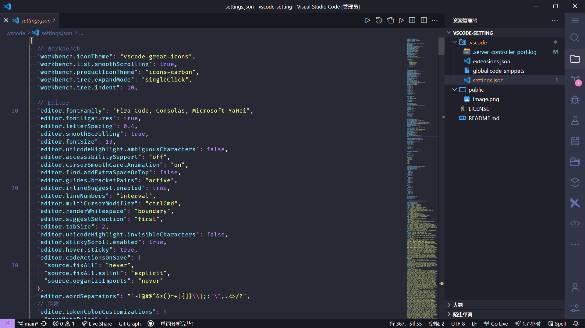

<samp><b>LeoStar's VS Code Settings</b></samp>

[`.vscode/settings.json`](./.vscode/settings.json) 
[`.vscode/extensions.json`](./.vscode/extensions.json) 
[`.vscode/global.code-snippets`](./.vscode/global.code-snippets)

 
 

<samp>Preview</samp>

 

## LICENSE

MIT
